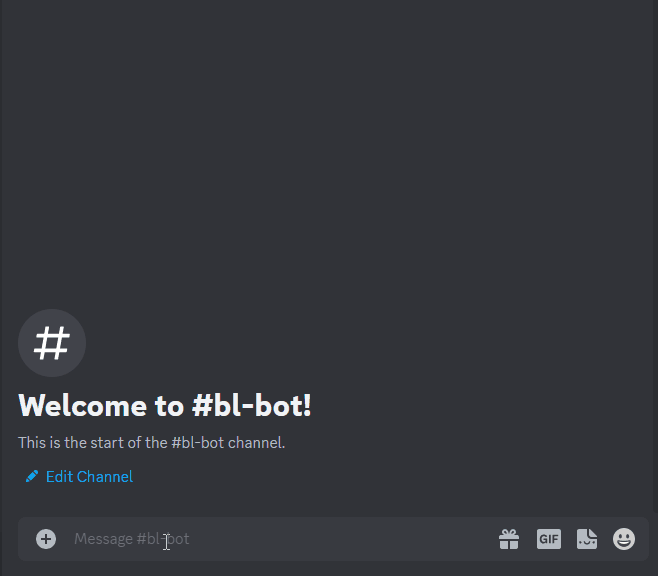

# Beat Leader Discord Bot

**Disclaimer**: I don't know what I'm doing, both in Rust and Discord territory. It may blow up in your face, be warned.

## What is this project?

A simple Discord bot providing the following commands:

- ``/bl-link`` / ``/bl-unlink``, allowing to link user account to Beat Leader profile  
- ``/bl-replay``, allowing to post replay according to set criteria 
- ``/bl-profile``, allowing to post user profile 
- ``/bl-add-auto-role`` / ``/bl-remove-auto-role``, allowing a user (role management permission required) to configure the automatic setting of selected roles to server users based on their BL profile. The roles to be set up are grouped, and each role can be assigned a set of multiple conditions that must be met for it to be given. 
- ``/bl-set-log-channel``, allowing to set the channel on which all role changes will be posted 
- ``/bl-show-settings``, showing current server settings 

## Setup

All of the following commands require a Rust environment installed on your computer.

1. Copy ``Secrets.example.toml`` as ``Secrets.toml`` and ``Secrets.dev.toml``. The first will be used production, the second for development.
2. Register bot:
- Go to [Discord Developer Portal](https://discord.com/developers/applications)
- Create New Application
- Copy Discord Token (click ``Reset Token`` button on Bot tab to obtain it) and set ``DISCORD_TOKEN`` in ``Secrets.toml``
3. Invite a bot to your server (**replace ``<APP_ID>`` with your application ID**, you can find it on General Information tab in Discord Developer Portal)
``https://discord.com/oauth2/authorize?client_id=<APP_ID>&scope=bot&permissions=2415937536``
   (required permissions: Manage roles, Embed links, Send Messages, Use Application Commands)
4. Create free [shuttle.rs](https://www.shuttle.rs/) account
5. ``cargo install cargo-shuttle``
6. ``cargo shuttle login``
7. ``cargo shuttle project start --idle-minutes 0``

## Deploy

```bash
cargo shuttle deploy
```

After you launch and invite the bot to your server, it will be visible in the list of users, but inaccessible. The bot does not automatically register Discord commands globally, you have to do it manually. To do this, after logging into the account that owns the bot, issue the command ``@BL Bot register`` (use the name you gave it). The bot will respond by displaying 4 buttons that allow you to register or delete commands globally or only on this server.


## Develop
```bash
cargo shuttle run
```